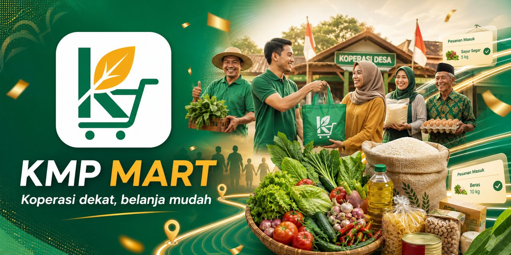
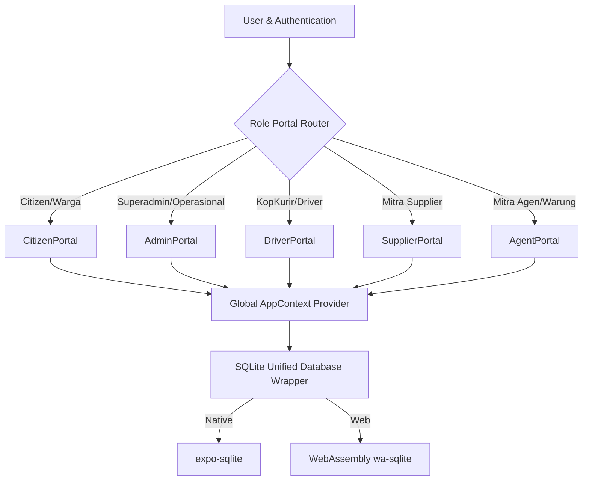

# KMP Mart (Koperasi Merah Putih Mart) 🇮🇩

<p align="center">
  
</p>

<p align="center">
  
</p>

### Platform Digitalisasi Koperasi Inklusif Desa (SIMKOPDES)

KMP Mart adalah platform digitalisasi koperasi inklusif desa yang berfungsi sebagai pilar ekonomi gotong royong warga desa. Aplikasi ini dibangun secara universal (Multiplatform: Android, iOS, dan Web) untuk mendistribusikan rantai pasok kebutuhan pokok warga secara adil, transparan, dan efisien.

---

## 📖 Dokumentasi Lengkap Projek (Folder [docs/](file:///Users/gustam/Developer/hackathon/kopmart/docs))

Untuk mempermudah pemahaman operasional dan teknis, folder **[docs/](file:///Users/gustam/Developer/hackathon/kopmart/docs)** berisi panduan terpisah yang sangat detail:

1. **[🛠️ Panduan Instalasi & Cara Menjalankan](file:///Users/gustam/Developer/hackathon/kopmart/docs/INSTALLATION.md)**: Langkah setup environment, instalasi dependensi, running simulator/HP fisik, dan troubleshooting.
2. **[👥 Panduan Akun Demo & Alur Kerja Peran](file:///Users/gustam/Developer/hackathon/kopmart/docs/ROLES_WORKFLOW.md)**: Kredensial akun simulasi dan langkah uji coba 5 peran utama (Warga, Admin, RT Agent, Kurir Desa, Pemasok) dari hulu ke hilir.
3. **[⚙️ Panduan Cara Kerja Sistem (System Mechanics)](file:///Users/gustam/Developer/hackathon/kopmart/docs/HOW_IT_WORKS.md)**: Alur data offline-first, siklus rantai pasok gotong royong, dan mekanisme pembukuan laba rugi.
4. **[🧠 Panduan Fitur & Teknis Basis Data](file:///Users/gustam/Developer/hackathon/kopmart/docs/FEATURES_DATABASE.md)**: Skema rinci 19 tabel SQLite, perhitungan surcharge dinamis, dan simulator GPS animasi.
5. **[📂 Pusat Indeks Panduan](file:///Users/gustam/Developer/hackathon/kopmart/docs/README.md)**: Indeks rangkuman seluruh panduan di dalam folder `docs/`.

---

## 🛠️ 1. Cara Instalasi dan Menjalankan Aplikasi

Aplikasi KMP Mart dibangun menggunakan **React Native (Expo)** dengan basis data lokal **SQLite** (menggunakan library `expo-sqlite` secara native dan mock local storage untuk web).

### Prasyarat Sistem
* **Node.js** (Versi 18 atau lebih tinggi)
* **npm** atau **yarn**
* Perangkat Android/iOS dengan aplikasi **Expo Go** terpasang, atau simulator emulator (Xcode / Android Studio).

### Langkah-Langkah Instalasi
1. Clone repositori ini ke komputer lokal Anda:
   ```bash
   git clone <repository-url>
   cd kopmart
   ```
2. Instal semua dependensi projek:
   ```bash
   npm install
   ```
3. Jalankan server pembangunan lokal Metro:
   ```bash
   npx expo start
   ```

### Menjalankan Aplikasi pada Perangkat
* **Platform Web (Browser)**: Tekan tombol **`w`** pada terminal dev server Anda untuk membuka aplikasi di browser komputer.
* **Simulator iOS**: Tekan tombol **`i`** untuk membuka simulator Xcode.
* **Simulator Android**: Tekan tombol **`a`** untuk membuka simulator Android Studio.
* **HP Fisik (Android/iOS)**: Pindai kode QR yang muncul di terminal menggunakan kamera HP (iOS) atau aplikasi Expo Go (Android).

---

## 👥 2. Panduan Akun Demo Berdasarkan Peran (Roles)

Untuk mempermudah presentasi atau uji coba selama demo, gunakan akun simulasi berikut yang telah terisi data awal (seed data) di database:

| Peran (Role) | Nama Demo | Nomor HP | PIN Demo | Detail Peran |
| :--- | :--- | :--- | :--- | :--- |
| **Warga** | Dinda | `081234567890` | `123456` | Belanja kebutuhan eceran, cek poin & referral, lacak kurir |
| **RT Agent** | Pak Budi | `081223344556` | `123456` | Koordinator pesanan kolektif RT (Batch Order), Drop Point RT |
| **Admin** | Mas Arif | `081299887766` | `123456` | Kelola stok barang, proses order, pantau keuangan & audit log |
| **Kurir Desa** | Mang Ujang | `081255667788` | `123456` | Terima tugas antar barang, lihat peta rute, kumpulkan uang COD |
| **Pemasok** | Dewi Lestari | `081244556677` | `123456` | Kirim pasokan barang grosir ke Koperasi, terima bayaran |

> [!TIP]
> Anda dapat berpindah peran secara cepat kapan saja tanpa logout melalui tombol **`Demo (Hammer Icon)`** di sudut kanan atas halaman Login.

---

## 🌟 3. Penjelasan Fitur Utama & Cara Penggunaan

### A. Fitur Warga (Citizen Portal)
1. **Multi-Cooperative Selector (Pilih Koperasi)**:
   * Warga dapat mengganti koperasi belanja melalui header atas di dashboard.
   * Tersedia peta wilayah lokal dan nasional yang menunjukkan 6 cabang Koperasi Merah Putih di seluruh Indonesia (Jawa, Bali, Sumatera, Sulawesi).
   * **Surcharge Dinamis**: Jika berbelanja di koperasi luar wilayah (jarak jauh), sistem akan otomatis menghitung surcharge pengiriman ekstra (Rp5.000 s/d Rp25.000) dan tambahan estimasi hari tiba secara dinamis.
2. **Belanja & Keranjang Sembako**:
   * Jelajahi barang eceran, tambah ke keranjang, gunakan voucher diskon, atau tukarkan **Poin Gotong Royong** sebagai potongan tunai langsung.
3. **Referral Gotong Royong**:
   * Ajak tetangga bergabung menggunakan kode unik Anda. Dapatkan bonus **10.000 Poin** setelah mereka berbelanja untuk pertama kalinya.
4. **Live Delivery Tracker (Simulasi Grab/Gojek)**:
   * Jika memilih metode **"Kirim ke Rumah"**, setelah checkout Anda akan otomatis disuguhkan dengan popup peta pelacakan kurir desa interaktif.
   * Anda bisa melihat posisi kurir (Mang Ujang) bergerak secara real-time sepanjang rute dari koperasi melewati belokan jalan desa hingga tiba di depan pintu rumah Anda.
   * Gunakan tombol **"Percepat Simulasi"** untuk mempercepat pergerakan kurir demi kelancaran demo.

### B. Fitur RT Agent (RTAgent Portal)
1. **Order Kolektif (Batch Delivery)**:
   * Membantu warga lansia atau non-smartphone memesan sembako secara kolektif untuk memangkas ongkos kirim.
   * RT Agent dapat memantau status pesanan batch yang sedang dikirim oleh kurir menuju Pos RT.
2. **Konfirmasi Penerimaan**:
   * Setelah barang tiba di drop-point Pos RT, agen memberikan konfirmasi digital untuk membagikan barang ke warga masing-masing.

### C. Fitur Admin & Operasional (Admin Portal)
1. **Fulfillment Queue & Riwayat Transaksi**:
   * Admin mengemas barang pesanan masuk, menandai barang siap diambil (untuk Ambil Mandiri), atau mendelegasikan pengiriman ke kurir (Kirim ke Rumah).
   * Riwayat Transaksi Selesai: Scroll ke bagian terbawah tab Fulfillment untuk melihat log lengkap transaksi yang telah selesai lengkap dengan detail waktu, metode penyerahan, dan status bayar.
2. **Manajemen Stok (Inventory)**:
   * Ubah harga barang, tambah stok masuk, atau pantau level persediaan sembako secara nasional.
3. **Finance & Immutable Ledger Audit Log**:
   * **Laporan Laba Rugi**: Menampilkan pendapatan kotor, biaya pengadaan barang, potongan poin, surcharge antar-koperasi, dan laba bersih secara real-time.
   * **Ledger Audit Log**: Menampilkan riwayat mutasi keuangan dan aksi penting petugas koperasi secara transparan dan tidak dapat dimanipulasi (immutable) untuk mencegah korupsi dana koperasi.

### D. Fitur Kurir Desa (Driver Portal)
1. **Task Board (Papan Tugas)**:
   * Kurir dapat menerima atau menolak tugas pengantaran sembako yang didelegasikan oleh Admin.
2. **Peta Rute Navigasi Driver**:
   * Kurir dapat menekan tombol **"Rute Peta"** pada kartu tugas untuk memunculkan navigasi peta rute.
   * **Pilihan Peta**: Dapat beralih secara dinamis antara **Google/Apple Maps** (native) dan **OpenStreetMap** (Leaflet JS WebView) untuk melihat visual jalur jalan desa.
   * Tombol **"Buka Navigasi"** akan membuka aplikasi peta navigasi GPS utama eksternal di handphone driver.
3. **Penyelesaian Tugas & COD**:
   * Kurir dapat mencatat PIN bukti penyerahan barang dan menginput jumlah uang tunai COD yang berhasil dikumpulkan dari warga untuk kemudian disetor ke admin koperasi.

### E. Fitur Pemasok (Supplier Portal)
1. **Supply Procurement Requests**:
   * Pemasok menerima order pembelian grosir dari admin koperasi.
   * Pemasok menandai pengiriman pasokan bahan pokok dan memantau status pembayaran piutang mereka.

---

## 🛠️ 4. Tech Stack Projek

KMP Mart didesain menggunakan teknologi modern untuk menjamin performa tinggi, kemudahan pengembangan, serta pengalaman pengguna yang mulus di berbagai perangkat:

| Komponen | Teknologi | Keterangan |
|---|---|---|
| **Core Framework** | **Expo v57.0.x** (React Native) | Framework universal untuk build native iOS, Android, dan Web dari satu codebase. |
| **Routing System** | **Expo Router** (File-based) | Navigasi deklaratif berbasis struktur direktori yang optimal untuk web dan native. |
| **Bahasa Pemrograman** | **TypeScript** | Memastikan keamanan tipe data (*type-safety*) dan meminimalkan bug di production. |
| **Styling Engine** | **NativeWind** (Tailwind CSS v3) | Memungkinkan penulisan styling adaptif menggunakan utility classes Tailwind di React Native. |
| **Database Lokal** | **expo-sqlite** & **wa-sqlite** | Database relasional SQLite untuk native, dan WebAssembly SQLite (`wa-sqlite`) untuk web. |
| **UI Primitives** | **@rn-primitives** | Kumpulan komponen UI tanpa gaya (unstyled) yang aksesibel dan ramah desain kustom. |
| **Optimasi Rendering** | **React Compiler (Experimental)** | Kompilator otomatis React untuk optimasi rendering dan memoisasi secara otomatis. |
| **Cross-Platform Icons** | **SymbolView Wrapper** | Sistem pemetaan SF Symbols (iOS) secara otomatis ke Material Symbols di Android/Web. |

---

## 📐 5. Arsitektur Sistem

KMP Mart menggunakan pola arsitektur **Offline-First Local-State Driven with Modular Portals**:



> [!TIP]
> Detail alur data teknis, siklus hulu-ke-hilir pengiriman logistik, serta mekanisme Ledger Keuangan dapat Anda pelajari di **[⚙️ Panduan Lengkap Cara Kerja Sistem](file:///Users/gustam/Developer/hackathon/kopmart/docs/HOW_IT_WORKS.md)**.


### 📂 Struktur Direktori Proyek
* **`src/app/`**: Kontainer routing navigasi aplikasi, mendefinisikan layout tab, halaman detail, dan explorer.
* **`src/components/`**: Komponen UI global seperti gateway login (`auth-gateway`), registrasi warga (`registration-modal`), dan laci demo juri (`user-menu`).
* **`src/components/portals/`**: Modul dashboard spesifik untuk masing-masing tipe peran/role (Citizen, Admin, Driver, Supplier, Agent).
* **`src/contexts/`**: `AppContext` sebagai pusat state aplikasi yang menampung data reaktif, memicu pembaruan database, serta sinkronisasi global.
* **`src/utils/`**: Konfigurasi mesin database `db.ts` untuk pembuatan skema tabel relasional, pengisian benih data awal (seeding), dan eksekusi transaksi SQL.

### 🛡️ Pola Database & State Management
1. **Derived State Pattern**: Menghindari sinkronisasi effect yang rentan render berulang (cascading renders) dengan menghitung nilai status secara dinamis pada saat render (misalnya: sisa limit kredit warga/mitra dihitung langsung dari relasi total pesanan aktif).
2. **Unified Write Transactions**: Pemrosesan transaksi checkout menggunakan transaksi SQL gabungan (atomic) untuk menjamin konsistensi stok barang, pencatatan transaksi koin loyalitas, dan pencatatan riwayat audit secara bersamaan.
3. **Purity Compliance**: Mematuhi aturan strict React Compiler dengan memindahkan fungsi generator ID dan manipulasi tanggal di luar tubuh komponen untuk menjamin sifat idempotent selama rendering.

---

## 🔮 6. Rekomendasi Arsitektur Masa Depan (Future Suggestion)

Untuk skala produksi tingkat nasional yang melayani ribuan desa, berikut adalah rekomendasi pengembangan arsitektur KMP Mart selanjutnya:

### 1. Sinkronisasi Data Offline-First Berbasis CRDT
* **Masalah**: Koneksi internet di wilayah pedesaan seringkali tidak stabil atau tidak ada (offline).
* **Solusi**: Integrasikan engine sinkronisasi dua arah seperti **PowerSync**, **WatermelonDB**, atau **ElectricSQL**. Teknologi ini secara otomatis menyinkronkan database lokal SQLite dengan database cloud (seperti PostgreSQL) di latar belakang menggunakan Conflict-Free Replicated Data Types (CRDT).

### 2. Transisi ke Query Caching Engine
* **Masalah**: Penggunaan React Context secara global untuk semua data reaktif berpotensi menurunkan performa render pada data skala besar.
* **Solusi**: Pindahkan manajemen pengambilan data server ke **@tanstack/react-query** (React Query). Ini mendukung caching otomatis, pembaruan di latar belakang (background refetching), pagination, serta *optimistic updates* ketika melakukan transaksi.

### 3. Arsitektur Monorepo & Micro-Frontends (Turborepo)
* **Masalah**: Kode dashboard admin, kurir, agen, dan warga yang berada di satu proyek membuat ukuran bundle aplikasi (*bundle size*) membengkak.
* **Solusi**: Gunakan monorepo menggunakan **Turborepo** atau **Nx**. Dashboard masing-masing role dipisah menjadi paket-paket independen yang dapat dideploy atau diuji secara terpisah, namun tetap berbagi komponen UI bersama (*shared components*).

### 4. Integrasi Perangkat Keras (NFC, QR, & GPS)
* **Masalah**: Pencatatan manual kurang efisien untuk interaksi fisik warga di warung/koperasi.
* **Solusi**: 
  * Gunakan **Native NFC API** untuk memindai kartu fisik Kopdes secara langsung ke ponsel Agen/Warung.
  * Integrasikan **Bluetooth Thermal Printer API** untuk mencetak struk belanja fisik langsung di Mitra Agen/Warung.
  * Tambahkan background GPS tracking pada modul KopKurir/Driver untuk peta pengantaran real-time.

### 5. API Type-Safety menggunakan GraphQL atau tRPC
* **Masalah**: Potensi ketidakcocokan tipe data antara REST API server backend dengan aplikasi client.
* **Solusi**: Implementasikan **tRPC** atau **GraphQL (Apollo/CodeGen)** untuk berbagi definisi tipe data TypeScript langsung dari backend ke aplikasi mobile secara instan tanpa perlu dokumentasi manual.
