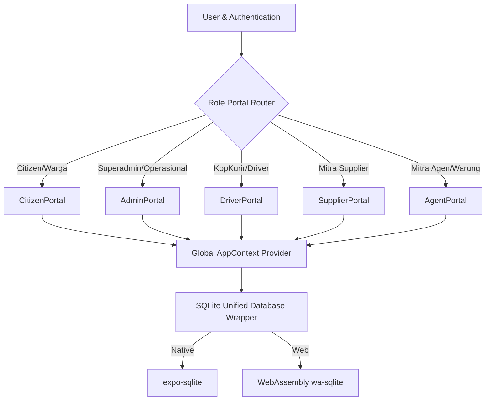

# KMP Mart (Koperasi Merah Putih Mart) 🇮🇩

KMP Mart adalah platform digitalisasi koperasi inklusif desa (SIMKOPDES) yang berfungsi sebagai pilar ekonomi gotong royong warga desa. Aplikasi ini dibangun secara universal (Multiplatform: Android, iOS, dan Web) untuk mendistribusikan rantai pasok kebutuhan pokok warga secara adil dan transparan.

---

## 🛠️ Tech Stack

KMP Mart didesain menggunakan teknologi modern untuk menjamin performa tinggi, kemudahan pengembangan, serta pengalaman pengguna yang mulus di berbagai perangkat:

| Komponen | Teknologi | Keterangan |
|---|---|---|
| **Core Framework** | **Expo v57.0.x** (React Native) | Framework universal untuk build native iOS, Android, dan Web dari satu codebase. |
| **Routing System** | **Expo Router** (File-based) | Navigasi deklaratif berbasis struktur direktori yang optimal untuk web dan native. |
| **Bahasa Pemrograman** | **TypeScript** | Memastikan keamanan tipe data (*type-safety*) dan meminimalkan bug di production. |
| **Styling Engine** | **NativeWind** (Tailwind CSS v3) | Memungkinkan penulisan styling adaptif menggunakan utility classes Tailwind di React Native. |
| **Database Lokal** | **expo-sqlite** & **wa-sqlite** | Database relasional SQLite untuk native, dan WebAssembly SQLite (`wa-sqlite`) untuk web. |
| **UI Primitives** | **@rn-primitives** | Kumpulan komponen UI tanpa gaya (unstyled) yang aksesibel dan ramah desain kustom. |
| **Optimasi Rendering** | **React Compiler (Experimental)** | Kompilator otomatis React untuk optimasi rendering dan memoisasi secara otomatis. |
| **Cross-Platform Icons** | **SymbolView Wrapper** | Sistem pemetaan SF Symbols (iOS) secara otomatis ke Material Symbols di Android/Web. |

---

## 📐 Arsitektur Sistem

KMP Mart menggunakan pola arsitektur **Offline-First Local-State Driven with Modular Portals**:

### 📂 Struktur Direktori Proyek
* **`src/app/`**: Kontainer routing navigasi aplikasi, mendefinisikan layout tab, halaman detail, dan explorer.
* **`src/components/`**: Komponen UI global seperti gateway login (`auth-gateway`), registrasi warga (`registration-modal`), dan laci demo juri (`user-menu`).
* **`src/components/portals/`**: Modul dashboard spesifik untuk masing-masing tipe peran/role (Citizen, Admin, Driver, Supplier, Agent).
* **`src/contexts/`**: `AppContext` sebagai pusat state aplikasi yang menampung data reaktif, memicu pembaruan database, serta sinkronisasi global.
* **`src/utils/`**: Konfigurasi mesin database `db.ts` untuk pembuatan skema tabel relasional, pengisian benih data awal (seeding), dan eksekusi transaksi SQL.

### 🛡️ Pola Database & State Management
1. **Derived State Pattern**: Menghindari sinkronisasi effect yang rentan render berulang (cascading renders) dengan menghitung nilai status secara dinamis pada saat render (misalnya: sisa limit kredit warga/mitra dihitung langsung dari relasi total pesanan aktif).
2. **Unified Write Transactions**: Pemrosesan transaksi checkout menggunakan transaksi SQL gabungan (atomic) untuk menjamin konsistensi stok barang, pencatatan transaksi koin loyalitas, dan pencatatan riwayat audit secara bersamaan.
3. **Purity Compliance**: Mematuhi aturan strict React Compiler dengan memindahkan fungsi generator ID dan manipulasi tanggal di luar tubuh komponen untuk menjamin sifat idempotent selama rendering.

---

## 🔮 Rekomendasi Arsitektur Masa Depan (Future Suggestion)

Untuk skala produksi tingkat nasional yang melayani ribuan desa, berikut adalah rekomendasi pengembangan arsitektur KMP Mart selanjutnya:

### 1. Sinkronisasi Data Offline-First Berbasis CRDT
* **Masalah**: Koneksi internet di wilayah pedesaan seringkali tidak stabil atau tidak ada (offline).
* **Solusi**: Integrasikan engine sinkronisasi dua arah seperti **PowerSync**, **WatermelonDB**, atau **ElectricSQL**. Teknologi ini secara otomatis menyinkronkan database lokal SQLite dengan database cloud (seperti PostgreSQL) di latar belakang menggunakan Conflict-Free Replicated Data Types (CRDT).

### 2. Transisi ke Query Caching Engine
* **Masalah**: Penggunaan React Context secara global untuk semua data reaktif berpotensi menurunkan performa render pada data skala besar.
* **Solusi**: Pindahkan manajemen pengambilan data server ke **@tanstack/react-query** (React Query). Ini mendukung caching otomatis, pembaruan di latar belakang (background refetching), pagination, serta *optimistic updates* ketika melakukan transaksi.

### 3. Arsitektur Monorepo & Micro-Frontends (Turborepo)
* **Masalah**: Kode dashboard admin, kurir, agen, dan warga yang berada di satu proyek membuat ukuran bundle aplikasi (*bundle size*) membengkak.
* **Solusi**: Gunakan monorepo menggunakan **Turborepo** atau **Nx**. Dashboard masing-masing role dipisah menjadi paket-paket independen yang dapat dideploy atau diuji secara terpisah, namun tetap berbagi komponen UI bersama (*shared components*).

### 4. Integrasi Perangkat Keras (NFC, QR, & GPS)
* **Masalah**: Pencatatan manual kurang efisien untuk interaksi fisik warga di warung/koperasi.
* **Solusi**: 
  * Gunakan **Native NFC API** untuk memindai kartu fisik Kopdes secara langsung ke ponsel Agen/Warung.
  * Integrasikan **Bluetooth Thermal Printer API** untuk mencetak struk belanja fisik langsung di Mitra Agen/Warung.
  * Tambahkan background GPS tracking pada modul KopKurir/Driver untuk peta pengantaran real-time.

### 5. API Type-Safety menggunakan GraphQL atau tRPC
* **Masalah**: Potensi ketidakcocokan tipe data antara REST API server backend dengan aplikasi client.
* **Solusi**: Implementasikan **tRPC** atau **GraphQL (Apollo/CodeGen)** untuk berbagi definisi tipe data TypeScript langsung dari backend ke aplikasi mobile secara instan tanpa perlu dokumentasi manual.
